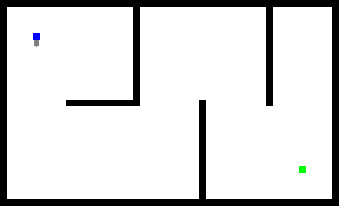

<p align="center">
    <a href="./docs/README_cn.md">简体中文</a>
    ·
    <a href="./docs/README_tc.md">繁體中文</a>
</p>

Overview
------
This repository implements some common path planning algorithms used in robotics, including Search-based algorithms and Sampling-based algorithms. This repository is the C++ version reference to [zhm-real's PathPlanning repository](https://github.com/zhm-real/PathPlanning), which is the Python version. 


Build & Run
------

```bash
git clone https://github.com/strongnine/PathPlanningCpp.git
cd PathPlanningCpp
mkdir build && cd build
cmake ..
make -j8
./src/SearchBasedPlanning/AStar
```

## Animations - Search-Based

### Best-First & Dijkstra

<div align=right>
<table>
  <tr>
    <td></a></td>
    <td></a></td>
  </tr>
</table>
</div>
